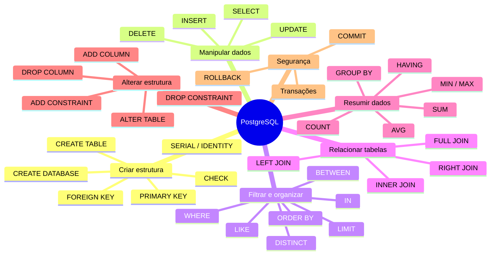

# 🎲 SAVE QUERRYS - AULA BD

Esse repositório foi criado para eu conseguir salvar todas as querrys que construimos nas aulas de Banco de Dados e Laboratório de banco de dados.

## 🚀 Guia rápido de consultas

 Um mapa mental para revisar os comandos usados em aula e encontrar rapidamente a estrutura de uma query.

<!--
## 🧠 Mapa mental



-->


## 1. Estrutura básica de uma query

```sql
SELECT coluna1, coluna2
FROM nome_tabela
WHERE condicao
ORDER BY coluna1 ASC
LIMIT 10;
```

| Parte | Para que serve |
|---|---|
| `SELECT` | Escolhe as colunas que serão exibidas. |
| `FROM` | Define a tabela de origem. |
| `WHERE` | Filtra os registros. |
| `ORDER BY` | Ordena o resultado (`ASC` crescente / `DESC` decrescente). |
| `LIMIT` | Limita a quantidade de linhas retornadas. |

---

## 2. Criar tabelas e inserir dados

### Criar tabela

```sql
CREATE TABLE aluno (
    id_aluno INT GENERATED ALWAYS AS IDENTITY PRIMARY KEY,
    nome VARCHAR(100) NOT NULL,
    email VARCHAR(150) UNIQUE,
    data_nascimento DATE,
    ativo BOOLEAN DEFAULT TRUE
);
```

### Inserir registros

```sql
INSERT INTO aluno (nome, email, data_nascimento)
VALUES ('Ana Silva', 'ana@email.com', '2002-05-10');
```

### Consultar tudo

```sql
SELECT * FROM aluno;
```

---

## 3. Filtrar consultas (`WHERE`)

```sql
-- Igualdade
SELECT * FROM aluno WHERE ativo = TRUE;

-- Comparação
SELECT * FROM aluno WHERE data_nascimento < '2000-01-01';

-- Texto parecido: % representa qualquer quantidade de caracteres
SELECT * FROM aluno WHERE nome ILIKE '%ana%';

-- Lista de valores
SELECT * FROM aluno WHERE id_aluno IN (1, 3, 5);

-- Intervalo
SELECT * FROM aluno
WHERE data_nascimento BETWEEN '2000-01-01' AND '2005-12-31';

-- Condições combinadas
SELECT * FROM aluno
WHERE ativo = TRUE AND nome ILIKE 'a%';
```

---

## 4. Editar e excluir dados

### Atualizar registros — `UPDATE`

```sql
UPDATE aluno
SET email = 'ana.silva@email.com'
WHERE id_aluno = 1;
```

> ⚠️ Sempre use `WHERE` no `UPDATE`, a menos que queira alterar todos os registros.

### Excluir registros — `DELETE`

```sql
DELETE FROM aluno
WHERE id_aluno = 1;
```

> ⚠️ Sempre use `WHERE` no `DELETE`, a menos que queira apagar todos os registros da tabela.

### Apagar todos os registros, mantendo a tabela

```sql
TRUNCATE TABLE aluno RESTART IDENTITY;
```

### Excluir a tabela inteira

```sql
DROP TABLE aluno;
```

---

## 5. Relacionamentos e `JOIN`

Imagine as tabelas `hospede` e `reserva`. Cada reserva pertence a um hóspede.

### `INNER JOIN` — somente registros com correspondência nas duas tabelas

```sql
SELECT h.nome, r.id_reserva, r.data_checkin
FROM hospede h
INNER JOIN reserva r ON r.id_hospede = h.id_hospede;
```

Use quando quiser ver apenas hóspedes que possuem reserva.

### `LEFT JOIN` — todos os registros da tabela da esquerda

```sql
SELECT h.nome, r.id_reserva
FROM hospede h
LEFT JOIN reserva r ON r.id_hospede = h.id_hospede;
```

Use quando também quiser listar hóspedes **sem reserva**. Nesse caso, os campos de `r` aparecem como `NULL`.

### Outros tipos

| Join | Retorno |
|---|---|
| `INNER JOIN` | Apenas registros relacionados nas duas tabelas. |
| `LEFT JOIN` | Todos da tabela à esquerda + correspondências da direita. |
| `RIGHT JOIN` | Todos da tabela à direita + correspondências da esquerda. |
| `FULL JOIN` | Todos os registros das duas tabelas, relacionados ou não. |

---

## 6. Funções de agregação

```sql
SELECT
    COUNT(*) AS total_reservas,
    SUM(valor_total) AS faturamento,
    AVG(valor_total) AS ticket_medio,
    MIN(valor_total) AS menor_valor,
    MAX(valor_total) AS maior_valor
FROM reserva;
```

### Agrupar dados — `GROUP BY`

```sql
SELECT id_hospede, COUNT(*) AS total_reservas
FROM reserva
GROUP BY id_hospede
HAVING COUNT(*) > 2;
```

| Comando | Função |
|---|---|
| `GROUP BY` | Agrupa linhas com o mesmo valor. |
| `HAVING` | Filtra os grupos após uma agregação. |
| `WHERE` | Filtra linhas antes do agrupamento. |

---

## 7. Alterar a estrutura da tabela — `ALTER TABLE`

```sql
-- Adicionar uma coluna
ALTER TABLE aluno ADD COLUMN telefone VARCHAR(15);

-- Alterar o tipo de uma coluna
ALTER TABLE aluno ALTER COLUMN telefone TYPE VARCHAR(20);

-- Renomear uma coluna
ALTER TABLE aluno RENAME COLUMN telefone TO celular;

-- Excluir uma coluna
ALTER TABLE aluno DROP COLUMN celular;

-- Criar uma regra CHECK
ALTER TABLE reserva
ADD CONSTRAINT chk_datas_reserva
CHECK (data_checkout > data_checkin);

-- Excluir uma constraint
ALTER TABLE reserva DROP CONSTRAINT chk_datas_reserva;
```

---

## 8. Chaves e integridade

```sql
CREATE TABLE reserva (
    id_reserva INT GENERATED ALWAYS AS IDENTITY PRIMARY KEY,
    id_hospede INT NOT NULL,
    data_checkin DATE NOT NULL,
    data_checkout DATE NOT NULL,
    CONSTRAINT fk_reserva_hospede
        FOREIGN KEY (id_hospede)
        REFERENCES hospede(id_hospede)
        ON DELETE CASCADE,
    CONSTRAINT chk_periodo_reserva
        CHECK (data_checkout > data_checkin)
);
```

| Elemento | Significado |
|---|---|
| `PRIMARY KEY` | Identifica cada registro de forma única. |
| `FOREIGN KEY` | Cria o relacionamento com outra tabela. |
| `NOT NULL` | Obriga o preenchimento do campo. |
| `UNIQUE` | Não permite valores repetidos. |
| `CHECK` | Impõe uma regra ao valor armazenado. |
| `ON DELETE CASCADE` | Ao excluir o registro-pai, exclui os registros-filhos relacionados. |

---

## 9. Ordem prática para montar consultas

1. Defina o que precisa aparecer: `SELECT`.
2. Identifique a tabela principal: `FROM`.
3. Relacione outras tabelas, se necessário: `JOIN ... ON`.
4. Filtre os dados: `WHERE`.
5. Agrupe, se houver contagem, soma ou média: `GROUP BY`.
6. Filtre agrupamentos: `HAVING`.
7. Ordene: `ORDER BY`.
8. Limite resultados, se necessário: `LIMIT`.

```sql
SELECT h.nome, COUNT(r.id_reserva) AS total_reservas
FROM hospede h
LEFT JOIN reserva r ON r.id_hospede = h.id_hospede
WHERE h.ativo = TRUE
GROUP BY h.id_hospede, h.nome
HAVING COUNT(r.id_reserva) >= 1
ORDER BY total_reservas DESC
LIMIT 10;
```

---

## 💡 Boas práticas

- Termine os comandos com `;`.
- Use nomes claros para tabelas e colunas.
- Prefira listar as colunas no `SELECT`, em vez de usar `SELECT *`, em consultas reais.
- Faça um `SELECT` com o mesmo `WHERE` antes de usar `UPDATE` ou `DELETE`.
- Use aliases para facilitar a leitura: `hospede h`, `reserva r`.
- Registre cada exercício em um arquivo `.sql` separado e descreva o objetivo no início do arquivo.

```sql
-- Objetivo: listar hóspedes com mais de duas reservas.
SELECT id_hospede, COUNT(*) AS total_reservas
FROM reserva
GROUP BY id_hospede
HAVING COUNT(*) > 2;
```
⚠️ TOMAR CUIDADO COM DELETE ⚠️

>Utilize BEGING e ROLLBACK para desfazer ações

-- Inicia o "modo teste":

`BEGIN;`

-- Excluir apenas 1 registro

```sql
DELETE FROM aluno
WHERE id_aluno = 1;
```

-- Desfaz a exclusão:

`ROLLBACK;`

-- Para confirmar a operação:

`COMMIT;`
